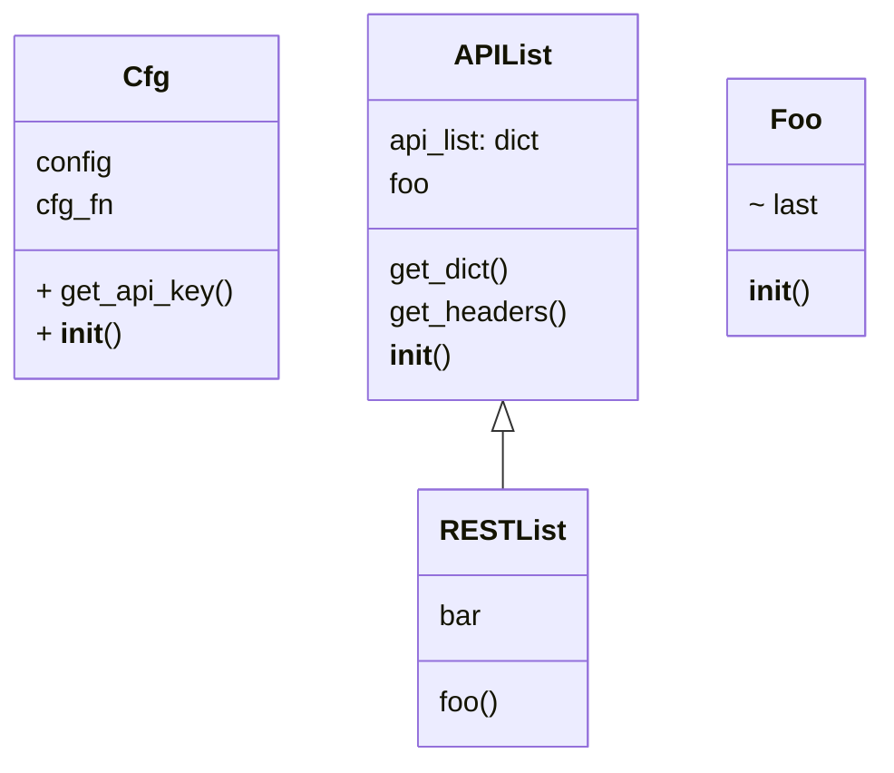
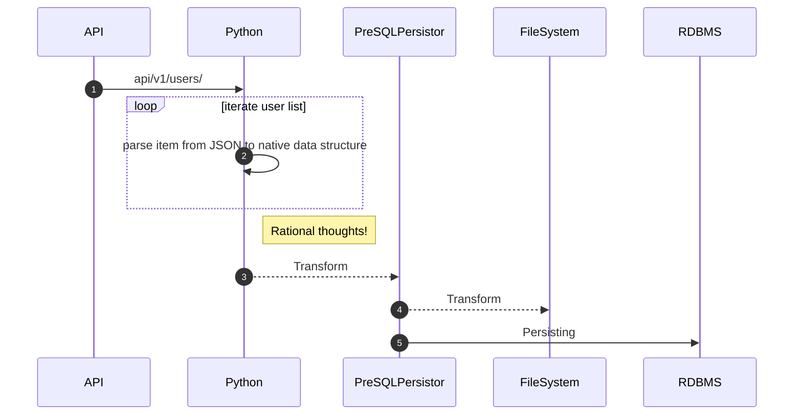
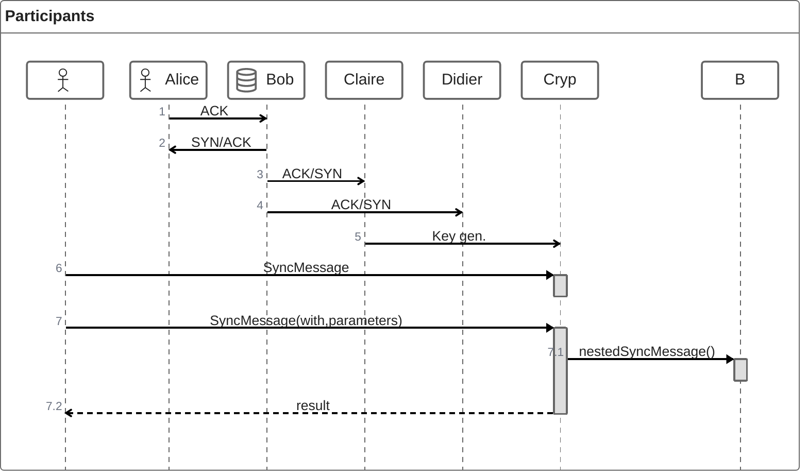

# Design and Archtitecture Dossier

## Class diagrams

```mermaid
classDiagram

class Cfg {
      config
      cfg_fn
    + get_api_key()
      
    + __init__()
}
class APIList {
    api_list: dict
    foo
    get_dict()
    get_headers()
        __init__()
}
class Foo {
        ~ last
    __init__()
}

class RESTList {
    foo()
        bar
}   

APIList <|-- RESTList

```

## Sequence diagram

```mermaid

sequenceDiagram
    autonumber
    API->>Python: api/v1/users/
    loop iterate user list
        Python->>Python: parse item from JSON to native data structure
    end
    Note right of Python: Rational thoughts!
    Python-->>PreSQLPersistor: Transform
    PreSQLPersistor-->> FileSystem: Transform
    PreSQLPersistor->>RDBMS: Persisting
    
```

## Securitiy implications

```mermaid
zenuml
    title Participants
    @Actor Alice
    @Database Bob
    Alice->Bob: ACK
    Bob->Alice: SYN/ACK
    Bob->Claire: ACK/SYN
    Bob->Didier: ACK/SYN
    Claire->Cryp: Key gen.
    Cryp.SyncMessage
    Cryp.SyncMessage(with, parameters) {
      B.nestedSyncMessage()
      return result
    }
```