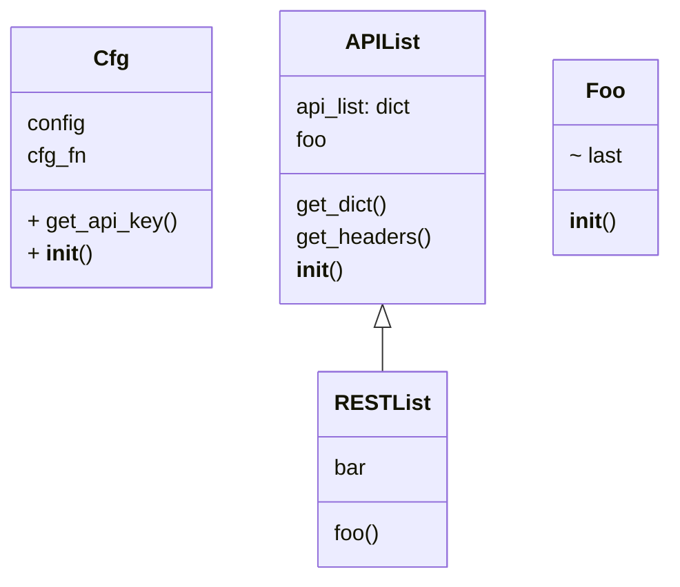

# Design and Archtitecture Dossier

## Class diagrams

```mermaid
classDiagram

class Cfg {
      config
      cfg_fn
    + get_api_key()
      
    + __init__()
}
class APIList {
    api_list: dict
    foo
    get_dict()
    get_headers()
        __init__()
}
class Foo {
        ~ last
    __init__()
}

class RESTList {
    foo()
        bar
}   

APIList <|-- RESTList

```